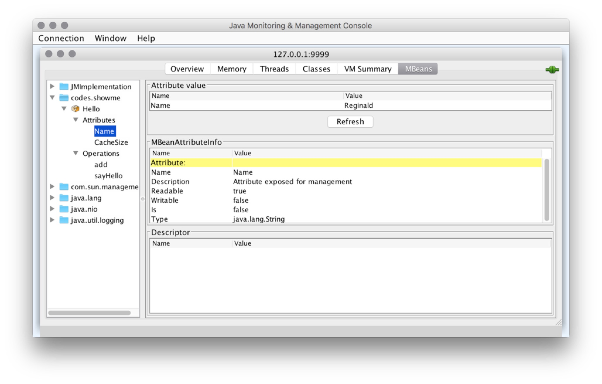

An example of JMX
---

## startup

use mvn to package our java code: `mvn compile package` then:

```
java -Dcom.sun.management.jmxremote \
-Dcom.sun.management.jmxremote.port=9999 \
-Dcom.sun.management.jmxremote.local.only=false \
-Dcom.sun.management.jmxremote.authenticate=false \
-Dcom.sun.management.jmxremote.ssl=false \
-Djava.net.preferIPv4Stack=true \
-Djava.rmi.server.hostname=127.0.0.1 \
-jar ./target/jmxexample-1.0-SNAPSHOT.jar codes.showme.App 
```

P.S. add this parameter if your jconsole can't connect to app's jmx port: `-Djava.rmi.server.hostname=127.0.0.1`


## setup jconsole log for debugging
```
jconsole -J-Djava.util.logging.config.file=/Users/jack/codebase/open-sources/jmxexample/jconsole-log4j.properties \
127.0.0.1:9999
```




## authorization
### simple username/password
1. create an access file for defining roles, like `jmxremote.access` in our example:
    ```
    monitorRole   readonly
    controlRole   readwrite
    ```
    
2. create a password file, like `jmxremote.password` in our example:

    ```
    ## Defining two "roles", each with its own password
    monitorRole  derbym
    controlRole  derby
    ```
    then `chmod 400  jmxremote.password` to prevent error: 
    **Error: Password file read access must be restricted: jmxremote.password**
    
3. add parameter to your command line:
    ```
    -Dcom.sun.management.jmxremote.access.file=jmxremote.access \
    -Dcom.sun.management.jmxremote.password.file=jmxremote.password \
    ```
    and have to set `-Dcom.sun.management.jmxremote.authenticate=true`

