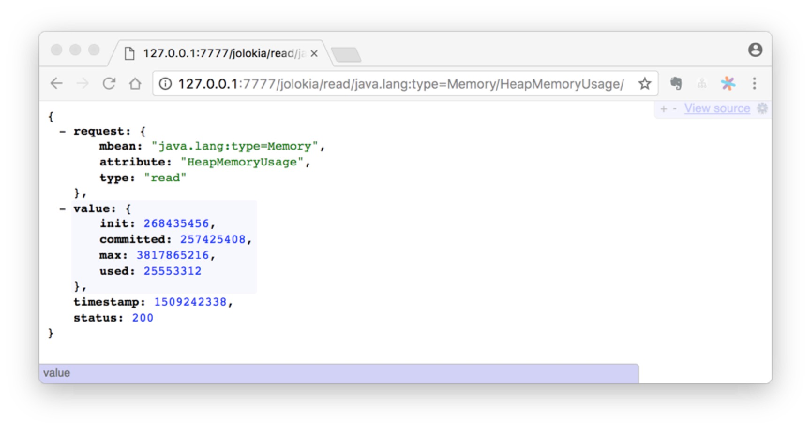

An example of JMX
---
WARNING: all example base on Java8.

## startup

use mvn to package our java code: `mvn compile package` then:

```
java \
-jar ./target/jmxexample-1.0-SNAPSHOT.jar \
-javaagent ./libs/jolokia-jvm-1.3.7-agent.jar=port=7777,host=localhost \
codes.showme.App 
```

P.S. add this parameter if your jconsole can't connect to app's jmx port: `-Djava.rmi.server.hostname=127.0.0.1`


## setup jconsole log for debugging
```
jconsole -J-Djava.util.logging.config.file=/Users/jack/codebase/open-sources/jmxexample/jconsole-log4j.properties \
127.0.0.1:9999
```


## authorization
### simple username/password
1. create an access file for defining roles, like `jmxremote.access` in our example:
    ```
    monitorRole   readonly
    controlRole   readwrite
    ```
    
2. create a password file, like `jmxremote.password` in our example:

    ```
    ## Defining two "roles", each with its own password
    monitorRole  derbym
    controlRole  derby
    ```
    then `chmod 400  jmxremote.password` to prevent error: 
    **Error: Password file read access must be restricted: jmxremote.password**
    
3. add parameter to your command line:
    ```
    -Dcom.sun.management.jmxremote.access.file=jmxremote.access \
    -Dcom.sun.management.jmxremote.password.file=jmxremote.password \
    ```
    and have to set `-Dcom.sun.management.jmxremote.authenticate=true`


## Using third jvm agent: jolokia

1. download [jolokia-jvm-agent](https://jolokia.org/download.html) to `libs`folder.
1. run example app with jolokia-jvm-agent:
    ```shell
    java \
    -javaagent:./libs/jolokia-jvm-1.3.7-agent.jar=port=7777,host=localhost \
    -jar ./target/jmxexample-1.0-SNAPSHOT.jar \
    codes.showme.App
    ```
1. read jmx mbean data in browser: http://127.0.0.1:7777/jolokia/read/java.lang:type=Memory/HeapMemoryUsage/
   you should get reference of [Jolokia protocol](https://jolokia.org/reference/html/protocol.html)
    
1. more about [jolokia jvm agent](https://jolokia.org/reference/html/agents.html#agents-jvm)

